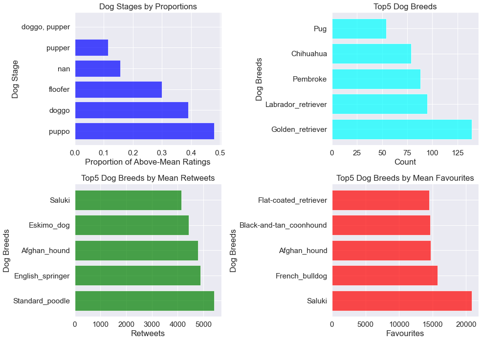
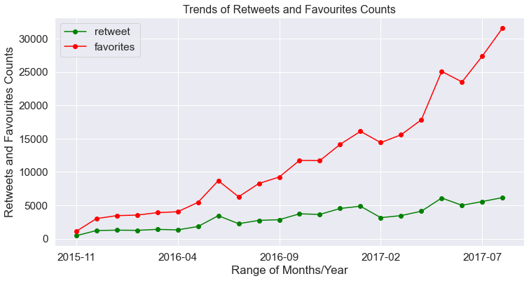

<h1 style="text-align: center;"> Analysis of WeRateDogs' Tweets</h1>

## Table of Content

1. <a href="#Introduction">Introduction</a>
2. <a href="#Analysis-Questions">Analysis Questions</a>
3. <a href="#Insights">Insights</a>
4. <a href="#Visualizations">Visualizations</a>

## Introduction

> WeRateDogs is a Twitter account that rates people's dogs with a humorous comment about the dog. These ratings almost always have a denominator of 10. The numerators, though? Almost always greater than 10. 11/10, 12/10, 13/10, etc. Why? Because "they're good dogs Brent." 
 

  

> The aim of this analysis is to display my proficiency in Data Wrangling by gathering the data of WeRateDogs from multiple sources and in different file formats, assessing for quality and tidiness issues then cleaning. After wrangling, I analysed the data to understand how twitter users react to the tweets of WeRateDogs. 
>
> Data was gathered from a CSV file, by querying Twitter API and downloading a TSV file from Udacity server. These datasets were then cleaned and analysed. The wrangling steps which involves gather, assess and clean can be found [here](https://github.com/Hassanat-Awodipe/Tweet-Analysis-of-WeRateDogs/blob/main/Analysis%20of%20WeRateDogs'%20Tweet%20-%20Code.ipynb). 
>
> In this report, I will be working with the final, cleaned dataset which has the following columns:
>
>   - `tweet_id` which is a unique id for each tweet
>
>   - `timestamp` which is the time the tweet was made
>
>   - `text` contains the actual tweet and the ratings
>
>   - `rating numerator and denominator` are derived from the tweet in text column
>
>   - `name` is the name of the dog in the tweet, also gotten from the text column
>   
>   - `retweet` is the count of retweets for that tweet
>
>   - `favourite` is the count of favourites for that tweet
>
>   - `dog stage` is the stage of the dog(s) in the tweet i.e. `doggo, fluffer, puppo, pupper`. The dog stage was invented by WeRateDogs
>
>   - `shortened_url` contains the abridged link of the tweet
>
>   - `main_urls` contains the full link with the tweet-id as the endpoint
>
>   - `additional_urls` contains the additional link associated with the tweet
>
>   - `jpg_url` contains the link to the image used for the prediction
>
>   - `img_num` is the number of the image that was used for the prediction
>
>   - `p1` is the algorithm's #1 prediction for the image in the tweet
>
>   - `p1_conf` is how confident the algorithm is in its #1 prediction
>
>   - `p1_dog` is whether or not the #1 prediction is a breed of dog
>
>   - `p2` is the algorithm's second most likely prediction 
>
>   - `p2_conf` is how confident the algorithm is in its #2 prediction 
>
>   - `p2_dog` is whether or not the #2 prediction is a breed of dog, etc

    There are 2175 rows and 23 columns
    

> This is what the first five rows of the dataset looks like

<table border="1" class="dataframe">
  <thead>
    <tr style="text-align: right;">
      <th></th>
      <th>tweet_id</th>
      <th>timestamp</th>
      <th>text</th>
      <th>rating_numerator</th>
      <th>rating_denominator</th>
      <th>name</th>
      <th>retweet_count</th>
      <th>favorite_count</th>
      <th>dog_stage</th>
      <th>shortened_url</th>
      <th>...</th>
      <th>img_num</th>
      <th>p1</th>
      <th>p1_conf</th>
      <th>p1_dog</th>
      <th>p2</th>
      <th>p2_conf</th>
      <th>p2_dog</th>
      <th>p3</th>
      <th>p3_conf</th>
      <th>p3_dog</th>
    </tr>
  </thead>
  <tbody>
    <tr>
      <th>0</th>
      <td>892420643555336193</td>
      <td>2017-08-01 16:23:56+00:00</td>
      <td>This is Phineas. He's a mystical boy. Only ever appears in the hole of a donut. 13/10</td>
      <td>13.0</td>
      <td>10</td>
      <td>Phineas</td>
      <td>7022</td>
      <td>33856</td>
      <td>NaN</td>
      <td>https://t.co/MgUWQ76dJU</td>
      <td>...</td>
      <td>1.0</td>
      <td>Orange</td>
      <td>0.097049</td>
      <td>False</td>
      <td>Bagel</td>
      <td>0.085851</td>
      <td>False</td>
      <td>Orange</td>
      <td>0.076110</td>
      <td>False</td>
    </tr>
    <tr>
      <th>1</th>
      <td>892177421306343426</td>
      <td>2017-08-01 00:17:27+00:00</td>
      <td>This is Tilly. She's just checking pup on you. Hopes you're doing ok. If not, she's available for pats, snugs, boops, the whole bit. 13/10</td>
      <td>13.0</td>
      <td>10</td>
      <td>Tilly</td>
      <td>5304</td>
      <td>29360</td>
      <td>NaN</td>
      <td>https://t.co/0Xxu71qeIV</td>
      <td>...</td>
      <td>1.0</td>
      <td>Chihuahua</td>
      <td>0.323581</td>
      <td>True</td>
      <td>Pekinese</td>
      <td>0.090646</td>
      <td>True</td>
      <td>Chihuahua</td>
      <td>0.068957</td>
      <td>True</td>
    </tr>
    <tr>
      <th>2</th>
      <td>891815181378084864</td>
      <td>2017-07-31 00:18:03+00:00</td>
      <td>This is Archie. He is a rare Norwegian Pouncing Corgo. Lives in the tall grass. You never know when one may strike. 12/10</td>
      <td>12.0</td>
      <td>10</td>
      <td>Archie</td>
      <td>3487</td>
      <td>22077</td>
      <td>NaN</td>
      <td>https://t.co/wUnZnhtVJB</td>
      <td>...</td>
      <td>1.0</td>
      <td>Chihuahua</td>
      <td>0.716012</td>
      <td>True</td>
      <td>Malamute</td>
      <td>0.078253</td>
      <td>True</td>
      <td>Chihuahua</td>
      <td>0.031379</td>
      <td>True</td>
    </tr>
    <tr>
      <th>3</th>
      <td>891689557279858688</td>
      <td>2017-07-30 15:58:51+00:00</td>
      <td>This is Darla. She commenced a snooze mid meal. 13/10 happens to the best of us</td>
      <td>13.0</td>
      <td>10</td>
      <td>Darla</td>
      <td>7234</td>
      <td>36971</td>
      <td>NaN</td>
      <td>https://t.co/tD36da7qLQ</td>
      <td>...</td>
      <td>1.0</td>
      <td>Paper_towel</td>
      <td>0.170278</td>
      <td>False</td>
      <td>Labrador_retriever</td>
      <td>0.168086</td>
      <td>True</td>
      <td>Paper_towel</td>
      <td>0.040836</td>
      <td>False</td>
    </tr>
    <tr>
      <th>4</th>
      <td>891327558926688256</td>
      <td>2017-07-29 16:00:24+00:00</td>
      <td>This is Franklin. He would like you to stop calling him "cute." He is a very fierce shark and should be respected as such. 12/10 #BarkWeek</td>
      <td>12.0</td>
      <td>10</td>
      <td>Franklin</td>
      <td>7773</td>
      <td>35348</td>
      <td>NaN</td>
      <td>https://t.co/AtUZn91f7f</td>
      <td>...</td>
      <td>2.0</td>
      <td>Basset</td>
      <td>0.555712</td>
      <td>True</td>
      <td>English_springer</td>
      <td>0.225770</td>
      <td>True</td>
      <td>Basset</td>
      <td>0.175219</td>
      <td>True</td>
    </tr>
  </tbody>
</table>

5 rows × 23 columns

> And this is the first tweet in the data as it appears on twitter

  

## Analysis Questions

> I gathered insights by asking the following questions:
>
> 1. Which dog stage had the highest rating?
>
> 2. How has the interaction on WeRateDog improved over the years the data was collected?
>
> 3. What breed of dog is mostly interacted with by WeRateDog followers based on retweet and favourite count 
>
> 4. Do you think the followers agree with the ratings?

#### 1. Which dog stage had the number of highest rating?

> Because the ratings denominator are not consistent across the dataset, it is hard to conclude that a rating of  660/450 has more value than a rating of 12/10. To normalize, this I found the score for each dog. This score was calculated as numerator/denominator. Then grouping by the dog_stage and I found the mean score for each stage. Also, since the dog_stage is not normally distributed (i.e left skewed), I examined the count of the dog stage for each mean score.
>
> Total counts for each dog stage

<table border="1" class="dataframe">
  <thead>
    <tr style="text-align: right;">
      <th></th>
      <th>index</th>
      <th>dog_stage</th>
    </tr>
  </thead>
  <tbody>
    <tr>
      <th>0</th>
      <td>NaN</td>
      <td>1832</td>
    </tr>
    <tr>
      <th>1</th>
      <td>pupper</td>
      <td>225</td>
    </tr>
    <tr>
      <th>2</th>
      <td>doggo</td>
      <td>77</td>
    </tr>
    <tr>
      <th>3</th>
      <td>puppo</td>
      <td>25</td>
    </tr>
    <tr>
      <th>4</th>
      <td>floofer</td>
      <td>10</td>
    </tr>
    <tr>
      <th>5</th>
      <td>doggo, pupper</td>
      <td>6</td>
    </tr>
  </tbody>
</table>

> By adding a score column for each dog, we can better understand the weight of the ratings. 

<table border="1" class="dataframe">
  <thead>
    <tr style="text-align: right;">
      <th></th>
      <th>tweet_id</th>
      <th>timestamp</th>
      <th>text</th>
      <th>rating_numerator</th>
      <th>rating_denominator</th>
      <th>name</th>
      <th>retweet_count</th>
      <th>favorite_count</th>
      <th>dog_stage</th>
      <th>shortened_url</th>
      <th>...</th>
      <th>p1</th>
      <th>p1_conf</th>
      <th>p1_dog</th>
      <th>p2</th>
      <th>p2_conf</th>
      <th>p2_dog</th>
      <th>p3</th>
      <th>p3_conf</th>
      <th>p3_dog</th>
      <th>score</th>
    </tr>
  </thead>
  <tbody>
    <tr>
      <th>0</th>
      <td>892420643555336193</td>
      <td>2017-08-01 16:23:56</td>
      <td>This is Phineas. He's a mystical boy. Only ever appears in the hole of a donut. 13/10</td>
      <td>13.0</td>
      <td>10</td>
      <td>Phineas</td>
      <td>7022</td>
      <td>33856</td>
      <td>NaN</td>
      <td>https://t.co/MgUWQ76dJU</td>
      <td>...</td>
      <td>Orange</td>
      <td>0.097049</td>
      <td>False</td>
      <td>Bagel</td>
      <td>0.085851</td>
      <td>False</td>
      <td>Orange</td>
      <td>0.076110</td>
      <td>False</td>
      <td>1.3</td>
    </tr>
    <tr>
      <th>1</th>
      <td>892177421306343426</td>
      <td>2017-08-01 00:17:27</td>
      <td>This is Tilly. She's just checking pup on you. Hopes you're doing ok. If not, she's available for pats, snugs, boops, the whole bit. 13/10</td>
      <td>13.0</td>
      <td>10</td>
      <td>Tilly</td>
      <td>5304</td>
      <td>29360</td>
      <td>NaN</td>
      <td>https://t.co/0Xxu71qeIV</td>
      <td>...</td>
      <td>Chihuahua</td>
      <td>0.323581</td>
      <td>True</td>
      <td>Pekinese</td>
      <td>0.090646</td>
      <td>True</td>
      <td>Chihuahua</td>
      <td>0.068957</td>
      <td>True</td>
      <td>1.3</td>
    </tr>
    <tr>
      <th>2</th>
      <td>891815181378084864</td>
      <td>2017-07-31 00:18:03</td>
      <td>This is Archie. He is a rare Norwegian Pouncing Corgo. Lives in the tall grass. You never know when one may strike. 12/10</td>
      <td>12.0</td>
      <td>10</td>
      <td>Archie</td>
      <td>3487</td>
      <td>22077</td>
      <td>NaN</td>
      <td>https://t.co/wUnZnhtVJB</td>
      <td>...</td>
      <td>Chihuahua</td>
      <td>0.716012</td>
      <td>True</td>
      <td>Malamute</td>
      <td>0.078253</td>
      <td>True</td>
      <td>Chihuahua</td>
      <td>0.031379</td>
      <td>True</td>
      <td>1.2</td>
    </tr>
    <tr>
      <th>3</th>
      <td>891689557279858688</td>
      <td>2017-07-30 15:58:51</td>
      <td>This is Darla. She commenced a snooze mid meal. 13/10 happens to the best of us</td>
      <td>13.0</td>
      <td>10</td>
      <td>Darla</td>
      <td>7234</td>
      <td>36971</td>
      <td>NaN</td>
      <td>https://t.co/tD36da7qLQ</td>
      <td>...</td>
      <td>Paper_towel</td>
      <td>0.170278</td>
      <td>False</td>
      <td>Labrador_retriever</td>
      <td>0.168086</td>
      <td>True</td>
      <td>Paper_towel</td>
      <td>0.040836</td>
      <td>False</td>
      <td>1.3</td>
    </tr>
    <tr>
      <th>4</th>
      <td>891327558926688256</td>
      <td>2017-07-29 16:00:24</td>
      <td>This is Franklin. He would like you to stop calling him "cute." He is a very fierce shark and should be respected as such. 12/10 #BarkWeek</td>
      <td>12.0</td>
      <td>10</td>
      <td>Franklin</td>
      <td>7773</td>
      <td>35348</td>
      <td>NaN</td>
      <td>https://t.co/AtUZn91f7f</td>
      <td>...</td>
      <td>Basset</td>
      <td>0.555712</td>
      <td>True</td>
      <td>English_springer</td>
      <td>0.225770</td>
      <td>True</td>
      <td>Basset</td>
      <td>0.175219</td>
      <td>True</td>
      <td>1.2</td>
    </tr>
  </tbody>
</table>

5 rows × 24 columns

> To understand the distribution of the score, we found the minimun, mean and maximum values.

    (0.0, 1.2203333333333302, 177.6)

> It is apparent that there are outlier scores. After removing the outliers, I grouped the data by dog stage then found the count of scores that are above the mean score in each dog stage. For example: in the table below, we can see that there are 286 dogs in the unidentified dog stage(NaN) that have scores above the mean.

<table border="1" class="dataframe">
  <thead>
    <tr style="text-align: right;">
      <th></th>
      <th>index</th>
      <th>count_above_mean</th>
    </tr>
  </thead>
  <tbody>
    <tr>
      <th>0</th>
      <td>NaN</td>
      <td>286</td>
    </tr>
    <tr>
      <th>1</th>
      <td>doggo</td>
      <td>30</td>
    </tr>
    <tr>
      <th>2</th>
      <td>floofer</td>
      <td>3</td>
    </tr>
    <tr>
      <th>3</th>
      <td>pupper</td>
      <td>26</td>
    </tr>
    <tr>
      <th>4</th>
      <td>puppo</td>
      <td>12</td>
    </tr>
    <tr>
      <th>5</th>
      <td>doggo, pupper</td>
      <td>0</td>
    </tr>
  </tbody>
</table>

> Finally, I created a table that shows the total count of dogs in each dog stage and the count of dogs with scores above the mean. We can also see the proportion dogs with high scores. Half of the dogs identified as Puppo had scores above the mean. None of the dog(s) identified as doggo, pupper had scores above the mean.

<table border="1" class="dataframe">
  <thead>
    <tr style="text-align: right;">
      <th></th>
      <th>dog_stage</th>
      <th>count_stage</th>
      <th>count_above_mean</th>
      <th>prop_high_rating</th>
    </tr>
  </thead>
  <tbody>
    <tr>
      <th>3</th>
      <td>puppo</td>
      <td>25</td>
      <td>12</td>
      <td>0.480000</td>
    </tr>
    <tr>
      <th>2</th>
      <td>doggo</td>
      <td>77</td>
      <td>30</td>
      <td>0.389610</td>
    </tr>
    <tr>
      <th>4</th>
      <td>floofer</td>
      <td>10</td>
      <td>3</td>
      <td>0.300000</td>
    </tr>
    <tr>
      <th>0</th>
      <td>NaN</td>
      <td>1832</td>
      <td>286</td>
      <td>0.156114</td>
    </tr>
    <tr>
      <th>1</th>
      <td>pupper</td>
      <td>225</td>
      <td>26</td>
      <td>0.115556</td>
    </tr>
    <tr>
      <th>5</th>
      <td>doggo, pupper</td>
      <td>6</td>
      <td>0</td>
      <td>0.000000</td>
    </tr>
  </tbody>
</table>

#### 2. How has the interactions on WeRateDog improved over the years the data was collected?

> Firstly, I found the period for which the data was collected then I aggregated based on that. [Grouping](https://datascientyst.com/extract-month-and-year-datetime-column-in-pandas/) the timestamp column into year and months, there were a total of 22 year/month. Then I got the mean retweet and favourite for each year/month pair.
>
> Duration of data collection

    (Timestamp('2017-08-01 16:23:56'), Timestamp('2015-11-15 22:32:08'))

>The data was collected from 15th November 2015 to 1st August 2017.

> I grouped the data by month/year and found the mean retweet and favourite count as shown below:

<table border="1" class="dataframe">
  <thead>
    <tr style="text-align: right;">
      <th></th>
      <th>timestamp</th>
      <th>retweet_count</th>
      <th>favorite_count</th>
    </tr>
  </thead>
  <tbody>
    <tr>
      <th>0</th>
      <td>2015-11</td>
      <td>439.370000</td>
      <td>1080.560000</td>
    </tr>
    <tr>
      <th>1</th>
      <td>2015-12</td>
      <td>1217.832474</td>
      <td>3009.603093</td>
    </tr>
    <tr>
      <th>2</th>
      <td>2016-01</td>
      <td>1279.443299</td>
      <td>3451.438144</td>
    </tr>
    <tr>
      <th>3</th>
      <td>2016-02</td>
      <td>1246.616000</td>
      <td>3533.664000</td>
    </tr>
    <tr>
      <th>4</th>
      <td>2016-03</td>
      <td>1392.470588</td>
      <td>3902.213235</td>
    </tr>
    <tr>
      <th>5</th>
      <td>2016-04</td>
      <td>1315.816667</td>
      <td>4037.233333</td>
    </tr>
    <tr>
      <th>6</th>
      <td>2016-05</td>
      <td>1823.700000</td>
      <td>5442.200000</td>
    </tr>
    <tr>
      <th>7</th>
      <td>2016-06</td>
      <td>3441.595745</td>
      <td>8694.734043</td>
    </tr>
    <tr>
      <th>8</th>
      <td>2016-07</td>
      <td>2248.865979</td>
      <td>6283.474227</td>
    </tr>
    <tr>
      <th>9</th>
      <td>2016-08</td>
      <td>2739.158730</td>
      <td>8277.126984</td>
    </tr>
    <tr>
      <th>10</th>
      <td>2016-09</td>
      <td>2845.115942</td>
      <td>9247.028986</td>
    </tr>
    <tr>
      <th>11</th>
      <td>2016-10</td>
      <td>3727.753425</td>
      <td>11743.082192</td>
    </tr>
    <tr>
      <th>12</th>
      <td>2016-11</td>
      <td>3634.568966</td>
      <td>11707.672414</td>
    </tr>
    <tr>
      <th>13</th>
      <td>2016-12</td>
      <td>4530.406780</td>
      <td>14145.169492</td>
    </tr>
    <tr>
      <th>14</th>
      <td>2017-01</td>
      <td>4869.647887</td>
      <td>16098.788732</td>
    </tr>
    <tr>
      <th>15</th>
      <td>2017-02</td>
      <td>3152.111111</td>
      <td>14410.291667</td>
    </tr>
    <tr>
      <th>16</th>
      <td>2017-03</td>
      <td>3458.614035</td>
      <td>15580.824561</td>
    </tr>
    <tr>
      <th>17</th>
      <td>2017-04</td>
      <td>4118.693878</td>
      <td>17838.734694</td>
    </tr>
    <tr>
      <th>18</th>
      <td>2017-05</td>
      <td>6100.555556</td>
      <td>25092.155556</td>
    </tr>
    <tr>
      <th>19</th>
      <td>2017-06</td>
      <td>4999.620000</td>
      <td>23512.900000</td>
    </tr>
    <tr>
      <th>20</th>
      <td>2017-07</td>
      <td>5572.566038</td>
      <td>27384.188679</td>
    </tr>
    <tr>
      <th>21</th>
      <td>2017-08</td>
      <td>6163.000000</td>
      <td>31608.000000</td>
    </tr>
  </tbody>
</table>

#### 3. What breed of dog is mostly interacted with by WeRateDog followers based on retweet and favourite count

> To calculate this, I isolated the concerned columns. 
>
> I also had to decide on which prediction of the algorithm to use. I compared the predictions to find out which had the mean highest confidence level. Then I created a dataframe for the prediction and reactions (retweet and favourite).

    (0.5939409197592783, 0.13441945135406208, 0.06024847793380137)

> The first prediction had the mean overall highest confidence level followed by the second (which recognised more dog breeds) then the third. So, I made use of the first prediction.
>
> This shows the first five rows.

<table border="1" class="dataframe">
  <thead>
    <tr style="text-align: right;">
      <th></th>
      <th>tweet_id</th>
      <th>p1</th>
      <th>p1_conf</th>
      <th>p1_dog</th>
      <th>favorite_count</th>
      <th>retweet_count</th>
    </tr>
  </thead>
  <tbody>
    <tr>
      <th>0</th>
      <td>892420643555336193</td>
      <td>Orange</td>
      <td>0.097049</td>
      <td>False</td>
      <td>33856</td>
      <td>7022</td>
    </tr>
    <tr>
      <th>1</th>
      <td>892177421306343426</td>
      <td>Chihuahua</td>
      <td>0.323581</td>
      <td>True</td>
      <td>29360</td>
      <td>5304</td>
    </tr>
    <tr>
      <th>2</th>
      <td>891815181378084864</td>
      <td>Chihuahua</td>
      <td>0.716012</td>
      <td>True</td>
      <td>22077</td>
      <td>3487</td>
    </tr>
    <tr>
      <th>3</th>
      <td>891689557279858688</td>
      <td>Paper_towel</td>
      <td>0.170278</td>
      <td>False</td>
      <td>36971</td>
      <td>7234</td>
    </tr>
    <tr>
      <th>4</th>
      <td>891327558926688256</td>
      <td>Basset</td>
      <td>0.555712</td>
      <td>True</td>
      <td>35348</td>
      <td>7773</td>
    </tr>
  </tbody>
</table>

> Since we are interested in the dog_breeds, I dropped the rows where the p1_dog is False, i.e where p1 is not a dog breed. We don't want 'Breed Unknown' in our analysis. This would leave us with 1477 rows.

> After the grouping, there were 111 dog breeds.

<table border="1" class="dataframe">
  <thead>
    <tr style="text-align: right;">
      <th></th>
      <th>dog_breeds</th>
      <th>retweet_count</th>
      <th>favorite_count</th>
      <th>breed_count</th>
    </tr>
  </thead>
  <tbody>
    <tr>
      <th>0</th>
      <td>Afghan_hound</td>
      <td>4793.000000</td>
      <td>14721.666667</td>
      <td>3</td>
    </tr>
    <tr>
      <th>1</th>
      <td>Airedale</td>
      <td>1121.250000</td>
      <td>4498.333333</td>
      <td>12</td>
    </tr>
    <tr>
      <th>2</th>
      <td>American_staffordshire_terrier</td>
      <td>1392.461538</td>
      <td>4888.461538</td>
      <td>13</td>
    </tr>
    <tr>
      <th>3</th>
      <td>Appenzeller</td>
      <td>1146.500000</td>
      <td>6277.500000</td>
      <td>2</td>
    </tr>
    <tr>
      <th>4</th>
      <td>Australian_terrier</td>
      <td>2506.000000</td>
      <td>9559.500000</td>
      <td>2</td>
    </tr>
    <tr>
      <th>...</th>
      <td>...</td>
      <td>...</td>
      <td>...</td>
      <td>...</td>
    </tr>
    <tr>
      <th>106</th>
      <td>Welsh_springer_spaniel</td>
      <td>411.333333</td>
      <td>2342.333333</td>
      <td>3</td>
    </tr>
    <tr>
      <th>107</th>
      <td>West_highland_white_terrier</td>
      <td>1256.571429</td>
      <td>5599.357143</td>
      <td>14</td>
    </tr>
    <tr>
      <th>108</th>
      <td>Whippet</td>
      <td>1886.888889</td>
      <td>7442.888889</td>
      <td>9</td>
    </tr>
    <tr>
      <th>109</th>
      <td>Wire-haired_fox_terrier</td>
      <td>2391.000000</td>
      <td>7202.000000</td>
      <td>2</td>
    </tr>
    <tr>
      <th>110</th>
      <td>Yorkshire_terrier</td>
      <td>1170.750000</td>
      <td>4370.000000</td>
      <td>8</td>
    </tr>
  </tbody>
</table>

111 rows × 4 columns

> These are Top5 Breeds based on **Count**

<table border="1" class="dataframe">
  <thead>
    <tr style="text-align: right;">
      <th></th>
      <th>dog_breeds</th>
      <th>retweet_count</th>
      <th>favorite_count</th>
      <th>breed_count</th>
    </tr>
  </thead>
  <tbody>
    <tr>
      <th>44</th>
      <td>Golden_retriever</td>
      <td>2946.741007</td>
      <td>10628.949640</td>
      <td>139</td>
    </tr>
    <tr>
      <th>60</th>
      <td>Labrador_retriever</td>
      <td>2958.010526</td>
      <td>9596.400000</td>
      <td>95</td>
    </tr>
    <tr>
      <th>78</th>
      <td>Pembroke</td>
      <td>2589.397727</td>
      <td>9869.261364</td>
      <td>88</td>
    </tr>
    <tr>
      <th>26</th>
      <td>Chihuahua</td>
      <td>2321.670886</td>
      <td>7583.949367</td>
      <td>79</td>
    </tr>
    <tr>
      <th>80</th>
      <td>Pug</td>
      <td>1451.611111</td>
      <td>4992.611111</td>
      <td>54</td>
    </tr>
  </tbody>
</table>

> These are Top5 Breeds based on **Favourite Count**

<table border="1" class="dataframe">
  <thead>
    <tr style="text-align: right;">
      <th></th>
      <th>dog_breeds</th>
      <th>retweet_count</th>
      <th>favorite_count</th>
      <th>breed_count</th>
    </tr>
  </thead>
  <tbody>
    <tr>
      <th>85</th>
      <td>Saluki</td>
      <td>4140.000000</td>
      <td>20821.250000</td>
      <td>4</td>
    </tr>
    <tr>
      <th>40</th>
      <td>French_bulldog</td>
      <td>3780.461538</td>
      <td>15733.461538</td>
      <td>26</td>
    </tr>
    <tr>
      <th>0</th>
      <td>Afghan_hound</td>
      <td>4793.000000</td>
      <td>14721.666667</td>
      <td>3</td>
    </tr>
    <tr>
      <th>10</th>
      <td>Black-and-tan_coonhound</td>
      <td>3317.000000</td>
      <td>14688.000000</td>
      <td>2</td>
    </tr>
    <tr>
      <th>39</th>
      <td>Flat-coated_retriever</td>
      <td>3732.000000</td>
      <td>14534.000000</td>
      <td>8</td>
    </tr>
  </tbody>
</table>

> These are Top5 Breeds based on **Retweet Count**

<table border="1" class="dataframe">
  <thead>
    <tr style="text-align: right;">
      <th></th>
      <th>dog_breeds</th>
      <th>retweet_count</th>
      <th>favorite_count</th>
      <th>breed_count</th>
    </tr>
  </thead>
  <tbody>
    <tr>
      <th>96</th>
      <td>Standard_poodle</td>
      <td>5421.571429</td>
      <td>13645.428571</td>
      <td>7</td>
    </tr>
    <tr>
      <th>36</th>
      <td>English_springer</td>
      <td>4878.111111</td>
      <td>13462.666667</td>
      <td>9</td>
    </tr>
    <tr>
      <th>0</th>
      <td>Afghan_hound</td>
      <td>4793.000000</td>
      <td>14721.666667</td>
      <td>3</td>
    </tr>
    <tr>
      <th>38</th>
      <td>Eskimo_dog</td>
      <td>4420.388889</td>
      <td>12640.666667</td>
      <td>18</td>
    </tr>
    <tr>
      <th>85</th>
      <td>Saluki</td>
      <td>4140.000000</td>
      <td>20821.250000</td>
      <td>4</td>
    </tr>
  </tbody>
</table>

#### 4. Do you think the followers agree with the ratings?

>To answer this question, I checked the relationship between ratings and reactions using a [correlation matrix]((https://datatofish.com/correlation-matrix-pandas/)). 

<table border="1" class="dataframe">
  <thead>
    <tr style="text-align: right;">
      <th></th>
      <th>rating_numerator</th>
      <th>rating_denominator</th>
      <th>score</th>
      <th>favorite_count</th>
      <th>retweet_count</th>
    </tr>
  </thead>
  <tbody>
    <tr>
      <th>rating_numerator</th>
      <td>1.000000</td>
      <td>0.182103</td>
      <td>0.982945</td>
      <td>0.009169</td>
      <td>0.011129</td>
    </tr>
    <tr>
      <th>rating_denominator</th>
      <td>0.182103</td>
      <td>1.000000</td>
      <td>-0.001729</td>
      <td>-0.025698</td>
      <td>-0.019640</td>
    </tr>
    <tr>
      <th>score</th>
      <td>0.982945</td>
      <td>-0.001729</td>
      <td>1.000000</td>
      <td>0.013990</td>
      <td>0.014874</td>
    </tr>
    <tr>
      <th>favorite_count</th>
      <td>0.009169</td>
      <td>-0.025698</td>
      <td>0.013990</td>
      <td>1.000000</td>
      <td>0.926393</td>
    </tr>
    <tr>
      <th>retweet_count</th>
      <td>0.011129</td>
      <td>-0.019640</td>
      <td>0.014874</td>
      <td>0.926393</td>
      <td>1.000000</td>
    </tr>
  </tbody>
</table>

## Insights

1. By taking the proportions of the dog stage into consideration, Puppos have the highest number of dogs above the mean score followed by doggo, floofer, None and Pupper.  

2. Genreally, the reactions on the twitter page of WeRateDogs have a progressive rate. It appears that from 2015 to 2017, the page increased in popularity and the reactions became more. On a month by year analysis of the data, there is a steady increase in rections. Some months had a decline but this was quickly compensated in the succeeding months. Also, retweets are genrally lower than favourites.   

3. Followers of WeRateDogs seemed to have a preference for Saluki and Afghan_hound. They both appeared in the top 5 dog breeds with the highest favourite or retweet count. Other dog breeds within this category include Standard_poodle, English_springer and Eskimo_dog in the top 5 dog breeds with the highest retweet count, and French_bulldog, Black-and-tan_coonhound and flat-coated_retriever in the top 5 dog breeds with the highest favourite count.

4. There is no [correlation](https://www.statology.org/how-to-read-a-correlation-matrix/) between favorite_count or retweet count and rating numerator. It is hard to conclude how followers react when the rating numerator in the tweet is low or high. There is a negative correlation between favorite_count or retweet count and rating_denominator. This suggests that when the rating_denominator from WeRateDogs is high, followers will likely not react to the tweet. Now, if we check the correlation between favorite_count or retweet count and score, we will see that there is no clear relationship between the ratings and the reactions. This may mean that followers react to the WeRateDogs's tweet based on the images or text of the tweet but not the ratings.

## Visualizations

> Here are the visualizations based on the above insights.
>
> The first figure shows the proportions of dog stage with high ratings, top5 breeds, top5 breeds by retweets and top5 breeds by favourites

    

    

> This second graph is a line chart for the progression of interactions on WeRateDogs from November 2015 to August 2017.

    

    

> Finally, I created a heatmap to show the correlation between reactions and ratings. The lighter colors indicate a positive correlation.

    

    

